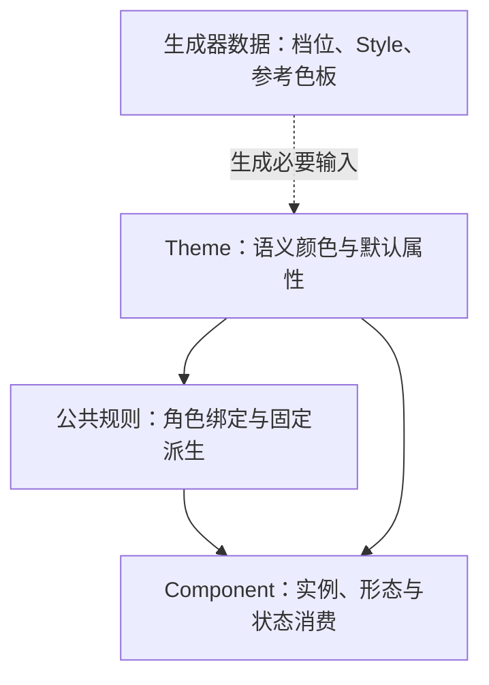

# QXFRAME9A7C2 主题、公共派生规则与组件视觉开发文档

版本：开发方案 v1.5（shadcn 原规则＋QX 结构适配＋共同性原则）  
日期：2026-10-03  
用途：统一开发约束、保存商讨结论、安排后续实现与验收。

本文件按《分析框架视觉统一问题》的完整讨论，以及此后关于 shadcn 语义 Token、明暗映射、混色和尺寸精简的商讨整理。后续明确的用户要求优先于早期建议；没有定稿的数值、实现方案与验证结果均单独标记。本文不代表改造已完成，也不把讨论中的源码观察当成本轮重新审计结果。

本轮最终架构：**Theme 输入 → 框架公共派生规则 → Component 消费。取消独立的基础预设 CSS Token 层。** 主题直接保存必要的完整颜色值与默认属性；框架内部持有步长、比例、上下限及公共算法。生成器仍可保存有限档位、Style 配方与成熟色板数据，它们不是另一个运行时 CSS Token 层。

颜色方面：**采用少量语义中性色与 Type 参考色，统一派生状态；不再要求主题输出完整 11／13 阶色板，也不输出组件 × Type × 状态矩阵。** 参考 shadcn 的精简程度，补齐 QX 实际需要的 success、warning、info、error 配套文字、遮罩、反转表面等角色。约三十多个到四十出头是颜色 Token 的设计预算，不是全部主题 Token 的总数，也不是必须与 shadcn 一样多。

尺寸方面：**主题只决定默认 md 属性；xs/sm/lg/xl 由框架固定规则在 CSS 中派生。** 密度不再锁死三档，可扩展为四档或更多协调的有限选项；具体数值继续标定。容器留白独立选择。

**颜色规则直接照抄锁定版本的 shadcn：包括主题角色到组件部位／形态／状态的分配、混色空间、比例、透明度和亮暗差异。若 shadcn 没有独立派生层，QX 按其 Theme→Component 分配关系创建公共派生层，只抽取复用，不重新设计颜色算法。** 新增 Type 复用对应现成规则并替换参考色，不另造比例。**派生层同时适配 QX 现有家族、组件部位、状态解析和 Popup／Scroll 依赖，遵守共同性原则：按共享视觉职责归纳，不按 shadcn 组件逐个复制一套。** 待完成的是来源登记、共性归纳、结构映射、迁移及等价验收；颜色参数不再列为自由标定项。本文只更新方案，未执行仓库实现或验收。

## 1. 项目目标与结论状态

### 1.1 项目目标

QX 是独立 UI 框架。目标是完善自身主题生成器，使同名 Style 的最终视觉特征靠近 shadcn/create 对应风格，同时保留 QX 的组件 API、必要的定制能力，并按新的三层职责收敛 CSS 取值链。

用户通过有限的预设选项调整圆角、阴影、间距、字体、动画、Shape Policy、Menu 等。Style 将这些**非颜色选项**组合成协调的风格；用户仍可单独修改任意一项。颜色独立选择。

主题文件应主要记录少量整体输入、默认尺寸属性、必要的亮暗语义完整颜色与实际启用的例外覆盖。框架拥有很多细粒度接口，不等于每份主题都要声明这些接口的默认值。新主题不提供逐尺寸几何覆盖或尺寸曲线配置；颜色、状态与默认属性的可选覆盖仍按职责保留。

现有默认 CSS 是过渡版本。先完善生成器和消费链，完成视觉验收，最后用生成器生成选定主题并替换旧默认主题。

### 1.2 状态标记

| 标记 | 含义 | 开发时如何使用 |
|---|---|---|
| 已明确 | 用户反复确认的目标或约束 | 作为实现要求 |
| 已形成方向 | 商讨中形成的可行方向，细节尚未全部定稿 | 先补契约和验证，再实现 |
| 历史观察 | 讨论记录中的源码检查、测量或参考数值 | 在锁定提交上复核，不当作最新仓库事实 |
| 待验证／待定 | 尚未得到结果，或存在多种可选方案 | 不写成承诺或既定配置 |
| 已撤回／被替代 | 后续讨论已纠正的判断 | 不再作为开发依据 |

### 1.3 核心约束

| ID | 已明确的约束 |
|---|---|
| R01 | 不混用 shadcn 组件；借鉴其最终视觉规则，不要求复制其内部实现。 |
| R02 | 保留必要的组件、部位、状态与默认属性定制能力，支持实例选择 xs–xl；主题只控制 md，其他档位固定派生。旧接口的处理不能成为新主题继续展开五档的理由。 |
| R03 | 正式生成器配置使用预设档位，不要求用户手填 CSS 数值。开发者高级入口是否保留另行决定。 |
| R04 | Style 只组合非颜色配置；颜色独立。Style 不应隐藏一套覆盖用户选择的组件固定值。 |
| R05 | 圆角选择为 `none / xs / sm / md / lg / xl`，没有含义随 Style 改变的 `default` 档。 |
| R06 | 取消独立基础预设 Token 层；Theme 提供少量语义输入，公共规则统一派生，Component 在当前作用域消费。 |
| R07 | **完整参考颜色由 Theme 拥有。** 组件不得直接调用旧色阶或硬编码业务颜色；框架可定义透明等数学端点和非颜色常量，不能借此建立第二套色板。 |
| R08 | Theme 在亮／暗模式分别定义同名颜色角色；颜色派生逐项采用 shadcn 原规则的模式差异，不自行反转、改比例或展开完整矩阵。 |
| R09 | 可选 Token 可以声明接口、被消费端引用，但未启用时不必定义、不必导出。删除覆盖后应恢复正常关联。 |
| R10 | 颜色公共层从 shadcn 的主题到组件分配规则抽取真实共性，抽取前后结果等价；没有共性不强制中转，不把状态矩阵整体搬入内部。 |
| R11 | 主题输出默认尺寸输入，框架共用固定派生算法；不能再给主题增加四个独立差值、倍率或 Style 专属尺寸修正。减少输入和重复声明，而不是更换表达式语法。 |
| R12 | 默认几何输入直接使用 Theme 的完整长度；其余档位在消费作用域计算。基础步长、索引、算法和系数由框架持有，主题与 Style 不另存尺寸曲线。 |
| R13 | 文本控件要适应多行内容；固定几何组件采用独立几何规则。 |
| R14 | 图标实心／空心承担状态含义，不能被 Style 当作统一装饰外观强制切换。 |
| R15 | 当前阶段整理、完善方案；仓库代码实现需作为后续工作单独开展。 |
| R16 | 密度使用协调的有限档位，数量可按需求扩展，不锁死三档；四档作为标定起点。容器留白独立选择，不合并为一个全局倍率。 |
| R17 | 颜色主题不强制声明完整中性色阶；基础表面、正文、次要文字和边框优先使用精心选择的语义参考色。 |
| R18 | success、warning、info 等 Type 与配套文字应覆盖实际组件需求；error 可承接 destructive，不重复建立两套同义颜色。 |
| R19 | Theme／Token 不建立 JS 运行时控制器。生成、预览和测试可用 JS；正式组件运行时视觉计算由 CSS 负责。 |
| R20 | 全站长度采用 rem，html 基准 16px；尺寸值遵守偶数原则，1px 边框例外。禁用 @layer、:is()、:where()、vw/vh/fr 和 display:grid，布局使用 flex。a11y／ARIA／RTL 不纳入本轮工作。 |
| R21 | 已完成的 CSS Token 重构不重做；新方案只处理被本轮决策替代的契约、消费链和生成器。 |
| R22 | 颜色算法、混色空间、比例、透明度、亮暗差异及角色分配直接照抄锁定 shadcn；不另行设计或标定 QX 比例。若源项目无独立派生层，按其 Theme→Component 关系抽取。 |
| R23 | 新增 Type／QX 专有部位先映射到 shadcn 已有同用途规则，只替换输入角色；原规则无额外状态时不凭空新增强度。真正无对应用途的条目记录缺口，不擅自发明公式。 |
| R24 | 派生层必须适配 QX 现有结构并遵守共同性原则：共享算法／视觉职责统一实现，家族绑定公共角色，组件只选择部位与状态。不得按外部组件逐个复制，也不得绕过现有 Popup／Scroll 依赖重建颜色体系。 |

## 2. 三层职责与生成器配置数据

### 2.1 最终主干



直接路径适用于无需派生的属性，例如卡片背景；不要求每个属性都增加中转变量。颜色派生层是对 shadcn Theme→Component 既有取值规则的抽取，不是要求 shadcn 本身已经存在该层。保持取值和运算结果，公共化结构可以不同。取消预设层不等于让各组件各自设计规则。

| 职责 | 保存内容 | 禁止内容 |
|---|---|---|
| Theme | 少量完整语义颜色、Type 参考色与配套文字、md 默认几何、必要字体／圆角／动效等输入，实际启用的覆盖 | 完整色阶、全部组件状态值、五档几何表、可调递进曲线 |
| 公共派生规则 | 按 shadcn 主题到组件分配抽取的颜色角色、原公式和模式参数；QX 的公共尺寸算法及家族共性 | 自创颜色系数、把所有用途强行套一个公式、把旧巨型矩阵改名搬入内部 |
| Component | 将实例 size／type／variant／state 映射到公共角色，处理专用部位与实际盒模型 | 直接消费旧 palette-N、自行挑色阶、独立混色比例、隐藏的 Style 最终值 |

Theme 输入可以直接是完整 OKLCH、rgb／rgba 等颜色和 rem 长度。框架内部可以定义步长、比例、边界及数学端点；可使用 Sass 常量／函数或少量 CSS 私有变量，但不能重新建设一套“内部预设层”供主题逐项选档。

### 2.2 保留的数据不构成预设 Token 层

| 名称 | 职责 |
|---|---|
| 选项档位表 | 密度、圆角、留白等有限组合；向普通用户提供易用选择，输出实际需要的默认输入 |
| Style Recipe | 组合非颜色选项，不隐藏另一套组件最终值 |
| Theme Preset | 现成主题配置实例，可包含 Style 与独立配色 |
| 参考色板 | 生成器内部可保存成熟完整色阶，用于选择语义参考值；不默认导出，也不供组件运行时直接消费 |
| Schema | 登记输入、可选覆盖、内部角色、类型与版本；公开接口不等于必须输出声明 |
| 生成器 | 解析配置、校验、导出输入和编辑元数据；不承担正式组件的运行时派生 |

### 2.3 归属与常量边界

颜色字面值的位置由职责决定，而不是看变量前缀：语义参考值归 Theme，状态结果由公共规则计算，组件只消费当前实例结果。生成器数据中允许保存参考色值。透明与数学端点可以在内部直接表达；真正影响外观的遮罩、反转表面、阴影基色应走约定的主题角色或统一默认关系，不能组件各写黑白。

非颜色常量在公共规则集中定义；无需给每一个 1px、系数、索引新增公开 Token。主题长度直接取完整值，不能为了“必须经过预设”增加一层别名。

`:root` 只是作用域，不决定职责。依赖当前表面、Type、尺寸或状态的结果应在实际消费作用域计算；主题边界应重新绑定必要角色。私有变量数量可以超过主题输入数量，但不能机械展开所有组合。

### 2.4 QX 结构适配与共同性原则

颜色算法与取值来源照抄 shadcn，运行时组织采用 QX 的结构。不能因源项目把规则写在 Button／Input／Table 等组件内，就在 QX 建立彼此孤立的同名派生模块。

本次为明确结构方向，定向读取了 `src/styles/theme/_family.scss`、`src/styles/components/_button.scss`、`src/styles/components/_card.scss`。现有 family 已包含 control、action、popup、surface、data、navigation、feedback 等角色；Button 已有 Type／variant 与 state 私有解析；Card 已使用 surface 家族和部位变量。这是结构入口确认，不是重新启动全仓审计，也不表示现有旧颜色矩阵可以原样保留。

| QX 现有职责 | 适配方式 | 必须避免 |
|---|---|---|
| control | Input、Textarea、Select／Picker control 等绑定同用途的输入背景、边界、文字角色 | 每个控件重新实现同一输入态算法 |
| action | Button、可交互 Tag／操作部位等复用相应实色、浅色、描边、ghost 角色 | 同 Type 同形态的算法因组件名而重复 |
| popup | 复用公共浮层表面、前景、边界及主题 ownership | Picker、submenu、overflow popup 各造一套浮层取色 |
| surface | Card 与其他表面消费既定 Theme 角色；部位按职责绑定 | 仅为中转增加大量等值别名，或把 card 与 popover 强行合并 |
| data／navigation | 同用途行／项的 hover、selected、高亮角色按源规则复用 | 将全部“选中”强制变成同一种颜色；已有源差异无故消失 |
| feedback | Alert／Message／状态图标等绑定当前 Type 与对应源形态规则 | success／warning／info 分别重写算法 |
| Component 部位与 state | 保留 QX 选择器、私有结果与现有状态机制，绑定公共颜色结果 | 把 shadcn DOM／ARIA／状态实现直接移植，或复制全部状态矩阵 |

表内角色是组织职责，不意味着每个家族、每个状态都要新增一个公开 Theme Token。应优先改造现有 family／公共样式入口；是否拆文件按维护需要决定，不另加必须经过的 CSS 层。

共同性按“用途、输入角色、形态／模式条件、原运算和参数”判断，不按组件名字判断，也不因两组当前色值恰好相等就合并不同语义。

1. 相同算法统一函数／mixin／公共表达式，所用比例必须能追溯源规则。
2. 相同用途与参数共用角色；只差 Type 时绑定当前参考色，算法不重复。
3. 共享只适用于相同职责。源规则或语义确有差别时保留对应 appearance／Style／角色分支，不能强行统一。
4. 组件专用解析只处理真实部位与结构差异，使用公共算法；专用项必须说明为什么无法直接共用。
5. 直接引用 Theme 的部位可以保持直接引用，不为了“共同性”增加等值中转变量。
6. 公共规则集中维护，但依赖当前 Type／局部主题的结果在正确作用域解析；公共化不等于全在 root 预先展开。

Popup／Scroll、组件依赖、键鼠焦点与状态协议继续由 QX 既有能力处理。颜色改造沿这些依赖贯通，不为满足外部实现形态重写框架结构。

## 3. 可选 Token、默认关系与覆盖顺序

### 3.1 可选性的准确含义

一个可选精细 Token 应满足：接口存在；默认可以不声明；未声明时走正常关联；声明后只覆盖对应属性；移除后恢复关联。

不能为了提供默认外观，给全部可选 Theme Token 填默认值。这样会挡住 `var()` 回退，也会让用户调整公共参数时，组件仍沿用预先填好的精细值。

默认外观必须存在，但默认值应来自主题输入、公共关系或组件消费端的默认引用，不等于每个可选覆盖入口都要有声明。

### 3.2 目标回退关系

普通路径为：**实际启用的精细覆盖 → 当前公共派生结果 → 当前 Theme 语义输入**。

没有适用公共派生项时，直接使用主题输入的默认关系；不增加无意义中转。默认回退必须跟随当前选中的颜色轴，不能让所有颜色按钮最终落到蓝色。

以下是说明职责的示意，短前缀不是已发布 API：

```css
/* 组件作用域的私有解析结果；可选覆盖入口默认不声明。 */
.qx-button {
  --_qx-button-hover-bg: var(
    --qx-theme-button-hover-bg,
    var(--_qx-common-action-hover-bg, var(--_qx-current-accent))
  );
}

.qx-button:hover {
  background-color: var(--_qx-button-hover-bg);
}
```

其中 `--_qx-current-accent` 必须已经按当前主题与 Type 解析到合法完整颜色；`--_qx-common-action-hover-bg` 只有在确有跨组件共性时才定义。示意只展示覆盖关系，实际 hover 默认效果由从 shadcn 抽取的公共形态／状态规则提供，不能让组件各自补一套比例。

### 3.3 覆盖范围与默认尺寸约束

显式、受支持的精细覆盖优先于公共关联，Style 的隐藏固定值不能盖住用户选择。新主题中的几何覆盖只作用于默认 md 属性；设置后，其他尺寸沿固定算法一起变化。派生的 xs/sm/lg/xl 几何值不再是新主题的覆盖入口。

颜色、状态、默认属性与实例／全局作用域的具体覆盖优先级仍需写成契约。显式 variant 与 Style 默认 appearance 的关系也需明确。可选覆盖未设置时走正常关联，不占用默认槽位。

历史的 `family-control-radius` 与通用 `theme-radius` 不能作为最终标量盖住派生结果。它们如果参与默认半径选择，必须先解析成当前角色的 md 输入，再计算当前 size 的圆角。

旧逐尺寸配置导入时必须报告能否归纳为新默认输入；不能静默丢弃不能归纳的用户值，也不能在新主题中重新开放整套逐尺寸例外。兼容路径与迁移策略见第 10 节。

### 3.4 作用域与局部主题

主题引用别名在父元素解析后可能作为已计算值继承。局部主题改变语义参考色、默认尺寸或表面绑定，不足以保证所有继承的派生别名重新解析。

开发时在主题边界应用当前模式的语义映射，并重新绑定依赖它的公共别名；尺寸私有结果优先在当前组件作用域解析。统筹与组件共用表达式，不为各个模式或 Style 另写派生算法。

可选覆盖项在嵌套主题中是否继承父主题，是尚需明确的策略。不能让局部切换意外继承一个已经锁定父模式色值的结果。

## 4. 全部问题登记表

优先级是本整理稿建议的实施顺序：P0 为主干约束／输出契约，P1 为风格映射与消费链，P2 为扩展视觉规范。历史观察均应复核后再登记代码修改。

| ID | 优先级 | 问题与影响 | 当前商讨结果／状态 | 验收方向 |
|---|---|---|---|---|
| Q01 | P0 | 预设、Theme、Style、公共规则和组件结果混在一起 | 已取消基础预设 Token 层，采用三层主干 | 每个输入／结果职责唯一，生成器数据不冒充 CSS 层 |
| Q02 | P0 | 旧预设联动与最终属性来源不一致 | Theme 直接保存 md 完整长度，内部派生其他 size | 改 md 后相关结果统一变化，不再依赖预设别名 |
| Q03 | P0 | 颜色来源与旧层级限制冲突 | 参考色归 Theme，旧固定色唯一归预设条款取消 | 组件没有旧色阶依赖或独立业务颜色 |
| Q04 | P0 | 参考色、模式语义和状态结果混淆 | Theme 定义少量完整参考色，按 shadcn 分配和算法抽取公共规则 | 取值与源规则等价，无完整矩阵 |
| Q05 | P0 | 可选 Token 被默认填满，公共关联与回退失效 | 未启用不声明、不导出 | 设置、删除覆盖均产生准确行为 |
| Q06 | P0 | 单主题约 630 KiB，颜色矩阵与明暗重复占大头 | 调整完整输出契约，保留少量输入及例外 | 同时统计主题与框架总量 |
| Q07 | P0 | Schema v1 的必填完整输出阻止压缩 | 后续版本化调整接口可选性与序列化 | 稀疏输出有效且旧主题迁移可验证 |
| Q08 | P0 | 状态整体搬入内部而没有共性抽取 | 按 shadcn Theme→Component 取值关系归纳；同规则复用、不同用途保留 | 源规则可追溯，抽取前后等价 |
| Q09 | P0 | 机械翻转色阶不能表达表面层级 | Theme 分别定义亮暗语义值，不再保留 13 阶主链 | 页面／Card／Popup 保持目标层级 |
| Q10 | P0 | 局部主题别名继承、嵌套模式、脱离容器的浮层取色 | 保留作用域与 Popup ownership 验证 | 局部与全局模式一致解析 |
| Q11 | P1 | Style 没有先解析成整组可见、可修改的选项 | Style 作为非颜色 Recipe | 选 Style 后各控件显示实际档位 |
| Q12 | P1 | Radius 的 Default 含义不明确，Style 锁 zero/pill | 六个具体档位；普通角色 follow，特殊形态显式解析 | Lyra/Sera 调大圆角后 follow 家族响应 |
| Q13 | P1 | 家族圆角和通用标量遮蔽尺寸派生 | 公共半径先作为 md 输入解析，再计算当前 size | md 正确、none 全档为零、派生结果可达 |
| Q14 | P1 | 每个属性导出五档 Theme 声明 | 仅输出默认属性，由框架固定算法派生其他档 | 无四档派生几何声明、总量减少 |
| Q15 | P1 | md 加四个可配差值仍是五个输入 | 不向主题开放差值或倍率；系数属于框架 | 改默认输入后全档一致联动 |
| Q16 | P1 | 所有属性共用一个公式不合理 | 按属性／几何家族固定算法；旧不规则曲线保存为对照 | 不为旧值或 Style 添加隐藏修正 |
| Q17 | P1 | 文本控件固定高度，行高与纵向 padding 没有共同映射 | 内容高度为基础；min-size 与固定几何分工 | 多行、长文本、图标组合不裁切 |
| Q18 | P1 | Control 密度和 Surface 留白被一个倍率统筹 | 两者独立选择默认属性；密度档数可扩展，留白独立 | 紧凑控件＋宽松留白可表达 |
| Q19 | P1 | Density 收集时回写 default，名称与结果不符 | 明确各有限档位，实际解析为默认属性，不锁死三档 | 档位顺序正确、Studio 往返保持真实选择 |
| Q20 | P1 | Shadow 档位只改 Button/Card，Popup 等未接入 | 投影分布与强度分开；边界和 Focus ring 独立 | 无投影不消除焦点／错误识别 |
| Q21 | P1 | Border 档只改控件线宽，容器/Divider 无统一层级 | 边界强调按色差与适度线宽分配 | 内部分隔线不抢外边界层级 |
| Q22 | P1 | Typography 只有基础字号/字体，不足以表达 Style | 建 Body、Heading、Label、Control、Meta、KPI 角色 | 字号、字重、行高、字距与间距联动 |
| Q23 | P1 | Motion 调 Theme 时长，部分组件仍取基础时长或固定值 | 接通动作角色；节奏、曲线、幅度分开 | none 与 reduced-motion 各自有效 |
| Q24 | P1 | State foreground 用途与表面混淆 | 按 shadcn 对应形态的角色分配；新增 Type 使用配套 foreground | 输入与源角色明确，派生公式不自创 |
| Q25 | P1 | 八种 Style 参考与 QX 数值不同 | 保存参考；Style 选择默认属性，其他尺寸服从公共固定算法 | 视觉特征可表达，差异报告明确 |
| Q26 | P2 | 图标圆直角、线重被组件写死；填充语义需保护 | 是否进入 Style 默认仍待定；不强制实心空心 | 默认、选中、加载状态含义一致 |
| Q27 | P2 | Empty 缺少稳定标题→说明→操作层级 | 收敛为框架角色规则 | Studio 不再单独补一套层级 |
| Q28 | P2 | Alert filled/outlined 不明显区分且采用浮层阴影 | 内嵌反馈独立外观与层级 | 变体确有背景／边界差异 |
| Q29 | P2 | 图表单色用于分类时可能辨识不足 | 单色是设计选择；分类规则按用途决定 | 单系列、连续数值、类别各有样例 |
| Q30 | P2 | Badge/Avatar halo 使用页面背景而非放置表面 | 明确局部表面归属 | Card、品牌色容器、重叠头像边圈协调 |
| Q31 | P2 | Card/Steps/Descriptions 只响应视口 | 增加宽页面窄容器验收，方案待选 | 400px 等窄容器不拥挤或错误排布 |
| Q32 | P2 | 小控件可见尺寸与点击范围一起缩小 | 两者分开设计；目标下限待定 | Tag close、Carousel 等触控可用 |
| Q33 | P2 | Card 骨架与 Table 遮罩无跨组件加载规范 | 区分初次加载、局部刷新、内容占位 | 无动画时仍明确表达加载状态 |
| Q34 | P2 | Field、原生输入、长文本等横向视觉规则未完整验收 | 作为规范补充，非已证实代码缺陷 | 错误字段、autofill、文件输入、缩放等样例 |
| Q35 | P2 | 材质、交互反馈强度、表面分离需要上层选择 | 已提出候选轴，是否开放待定 | 不破坏对比度、Focus 和颜色独立性 |

## 5. Style 与预设选项设计

### 5.1 配置关系

最终非颜色配置 = Style 选择的预设项 + 用户单项修改。最终主题同时接受独立颜色选择。

Style 给出明确档位，不保存另一个会在编译最后覆盖用户选择的隐藏值。改 Radius 不应改变控件密度、Card 留白或阴影；改 Shadow 不应改变字体与圆角。确有耦合的选项应明确联合解析，例如表面分离策略与已启用投影的强度。

Style 切换应刷新非颜色选项；是否保留锁定项、如何区分手改与锁定，尚需定稿。讨论中建议锁定项可保留，但该建议不能被当作用户已批准的完整交互规则。

### 5.2 选项轴候选表

Radius 六档和“主题只控制默认尺寸”的契约已明确。控件密度不再限制三档，四档作为标定起点；容器留白使用独立有限档位。其余轴的开放范围和物理值继续按状态标记处理。

| 选项轴 | 候选档位／内容 | 关联范围与注意事项 |
|---|---|---|
| `radius` | `none/xs/sm/md/lg/xl` | 基础圆润程度；不同于组件 size |
| `cornerDistribution` | 标准、偏圆控件、柔和整体等 | 各家族的圆角层级关系，不能暗中锁死普通角色 |
| `shapePolicy` | `follow/intrinsic/square` | Radio、Switch、Avatar、Slider 等特殊形态；具体角色矩阵待定 |
| `controlDensity` | 四档起点，允许按需要扩展 | 每档选择协调的 md 属性；xs/sm/lg/xl 共享框架固定算法 |
| `surfaceSpacing` | 独立有限留白档位 | 默认容器留白与内容间隔；独立于控件密度，有 size 的角色按固定算法派生 |
| `surfaceSeparation` | 轮廓主导、均衡、柔和抬升等 | 表面色差、轮廓与投影分布；不指定具体品牌色 |
| `shadowStrength` | 无、微弱、标准、明显等 | 已启用装饰投影的强度；Focus ring 独立 |
| `borderEmphasis` | 轻、标准、清晰等 | 容器、控件、Divider 的边界层级 |
| `typography` | 标准、紧凑、等宽倾向、编辑式等 | 各文字角色的字号、字重、行高、字距、大小写与间距 |
| `typographyHierarchy` | 克制、标准、鲜明等 | 是否作为独立轴开放待定；可以先作为排版配方内部参数 |
| `controlAppearance` | 描边、填充、下划线等 | Style 默认控件表现；显式组件 variant 的规则要清楚 |
| `motionPace` | 无装饰动画、快、标准、舒缓等 | 反馈、Tooltip、Popup、Modal、Drawer 的角色节奏 |
| `motionCurve` | 克制、柔和、鲜明等 | 采用完整预设曲线，不按名字编造参考风格的差异 |
| `motionAmplitude` | 无位移、轻、明显等 | 位移／缩放与时长独立；是否开放为高级项待定 |
| `menuRecipe` | 常规、紧凑、柔和悬浮、编辑式等候选 | 菜单结构、高亮形态与公共角色选择；不另存尺寸曲线或隐藏圆角、阴影、间距表 |
| `feedbackEmphasis` | 弱、标准、明显等 | Hover/Active/Selected 的反馈；Focus 保留可见性要求 |
| `material` | 实色、半透明等 | 表面及模糊策略；是否进入首版待定 |
| 图标策略 | 圆／直端点、线重 | 默认是否由 Style 提供待定；填充状态由语义决定 |

顶层配置不必为每个 CSS 属性提供一个选项。共享规则可以隐藏在经过标定的配方中；用户界面只暴露有实际使用价值的有限选择。

### 5.3 八种 Style 的参考测量

以下数据保留自讨论，**是外部视觉参考，不是 QX 已定稿预设**。在最新契约下，Style 选择默认属性，其余尺寸服从公共算法；不再为精确复刻外部每一档而增加 Style 专属递进值。当时统一 `1rem=16px`，圆角例子统一参考 `--radius=10px`；参考圆角层级比例为 `0.8/1/1.4/1.8/2.2/2.6`。具体 shadcn 提交 SHA 未在导出内容中完整登记，开发前须补齐，不能直接拿最新主分支替代。

| Style | 按钮 xs/sm/默认/lg 高度（px） | 默认按钮横向 padding（px） | Card 默认/小号留白（px） | 按钮/Card/Menu 圆角（px） | Card/Menu/Dialog 装饰投影 |
|---|---|---|---|---|---|
| Vega | 24/32/36/40 | 10 | 24/16 | 8/14/8 | xs/md/无 |
| Nova | 24/28/32/36 | 10 | 16/12 | 10/14/10 | 无/md/无 |
| Maia | 24/32/36/40 | 12 | 24/16 | 26/18/18 | 无/2xl/无 |
| Lyra | 24/28/32/36 | 10 | 16/12 | 0/0/0 | 无/md/无 |
| Mira | 20/24/28/32 | 8 | 16/12 | 8/10/10 | 无/md/无 |
| Luma | 24/32/36/40 | 12 | 24/16 | 26/26/22 | md/lg/xl |
| Sera | 28/36/40/44 | 24 | 32/20 | 0/0/0 | sm/md/md |
| Rhea | 24/28/32/36 | 12 | 20/16 | 18/24/18 | sm/lg/xl |

投影名称属于参考系统，不能直接等同 QX 同名 shadow 档。“无投影”也不等于没有 ring 或边框。

| Style | 预设组合应保留的特征 | 额外标定重点 |
|---|---|---|
| Vega | 均衡控件、标准留白、克制圆角 | 基准文字与轮廓 |
| Nova | 紧凑控件与紧凑表面 | 与 Rhea 相同控件高度但不同 Card 留白 |
| Maia | 更圆控件、宽松表面、轮廓 Card、较强 Menu 投影 | Card 无投影不代表全局无投影 |
| Lyra | 方正初始圆角、紧凑几何、等宽倾向 | 用户改圆角后普通 follow 角色仍须响应 |
| Mira | 更高信息密度、较小控件文字 | 参考 xs 是 20px，不能误用现有 QX 的 22px |
| Luma | 整体圆润、柔和填充、逐层抬升 | Card 与 Menu 的独立半径和投影 |
| Sera | 方角、编辑式留白、衬线标题、大写字距、下划线控件 | 不能只用一个 density 倍率表达 |
| Rhea | 保留圆润与投影分布，收紧控件和留白 | 32px 输入与 20px Card 留白 |

参考输入框：Vega 36px 描边与细投影；Nova 32px 描边；Mira 28px 且文字更小；Luma 36px 柔和填充；Rhea 32px 填充；Sera 40px 以底边线为主。Maia、Lyra 的详细输入规则需在参考基线表中补齐。

参考排版：Lyra/Mira 按钮约 12px；Sera 按钮约 12px、较重字重、大写与宽字距，Card 标题约 18px；普通参考 Card 标题多约 16px、medium 字重。大小写对中文内容的作用需要单独验收。

参考动画：当时检查的八种 Menu/Dialog 入场均有 100ms 规则；Rhea Input 另有 200ms 规则。没有足够依据给八种 Style 编造八条不同曲线。多个 Style 采用相同动画档位是合理结果。

### 5.4 各维度如何缩减默认输出

| 维度 | 新主题必须提供的内容 | 框架复用的内容 |
|---|---|---|
| 颜色／明暗 | 少量语义完整参考色与必要配套文字 | 当前 Type、所属表面与共享状态关系 |
| Radius／圆角分配／Shape Policy | 基础圆角选择与默认角色分配 | 固定 size 比例、内外几何、固有 circle/pill 策略 |
| 控件密度 | 有限档位解析出的必要 md 输入 | 其他四档尺寸、重复字号与纵向 padding 关系 |
| 容器留白 | 默认表面／内容角色的输入 | 共用角色与固定派生关系，子控件 size 不改变父容器 |
| 表面分离／投影／边界 | 分布策略、默认强度与必要角色引用 | 共用层级；Focus 与错误识别独立 |
| 排版 | 默认文字角色与字体选择 | 控件字号／行高固定派生；Typography 和 Density 联合解析一次 |
| 动效 | 节奏、曲线及必要动作角色输入 | 同类动作共享规则，不按 size 机械缩放 |
| Menu | 结构、高亮形态与公共档位选择 | 公共尺寸、圆角、排版、表面和投影关系 |
| 图标／反馈／材质等候选 | 实际开放的少量输入或高级选项 | 状态填充语义、共享反馈与材质规则 |

Style 与各轴选择保存在生成器配置中，供导入和继续编辑。CSS 导出的是所需完整默认值与参数，不必为每个选项名称创建变量，也不序列化全部计算结果。Typography 与 Density 不各写一套控件文字默认值；Menu 不用隐藏值盖住公共选项。

## 6. 默认尺寸与框架固定派生算法

### 6.1 已确定的尺寸契约

**主题只决定默认 md 尺寸属性，其他尺寸由框架固定算法计算。** “默认”指组件的 md 基准，不是 Radius 中含义不明的 `default` 选项。

主题密度选择一组协调的默认属性；实例 `is-xs/is-sm/is-md/is-lg/is-xl` 选择当前派生档。主题 `radius=lg` 表示圆润程度，不会把组件变成 `is-lg`。

默认输入按实际共性建立：文本控件、容器与固定几何组件可以有各自的 md 基准；不能让全框架所有属性只依赖一个高度。组件专属默认输入仅在确有差异时使用，并遵守稀疏覆盖。

框架持有尺寸索引、步长、比例、上下限和几何约束。主题、Style 与密度预设不分别提供另一条曲线，也不提供 xs 修正项。新增算法需要作为框架规则版本化验证。

### 6.2 可扩展的有限控件密度

普通用户选择有限密度档位，不填写 CSS 长度、五档列表或递进系数。档位不锁死三档；四档作为当前建议起点，名称与物理值待视觉标定。每档选择协调的 md 单行最小尺寸、字号、行高、横向 padding、图标和内容 gap；纵向 padding 优先从几何关系得到。

以下是本轮提出的标定初稿，单位 px；精确物理值尚未完成全组件视觉验证。

| 密度预设 | xs | sm | 默认 md | lg | xl |
|---|---:|---:|---:|---:|---:|
| 极紧凑（候选名） | 20 | 24 | 28 | 32 | 36 |
| 紧凑（候选名） | 24 | 28 | 32 | 36 | 40 |
| 标准（候选名） | 28 | 32 | 36 | 40 | 44 |
| 宽松（候选名） | 32 | 36 | 40 | 44 | 48 |

表中每档主题只决定 md，另外四列由同一套加减规则产生。不同 Style 可以选择相同密度；不能在 Style 内给某个 size 再补特殊值。

容器留白独立选择，可显示紧凑／正常／宽松等有限档位，但档数不必与控件密度一致；它选择另一组默认表面和内容间隔。紧凑控件配宽松 Card 是合法组合，不合并成一个全局倍率。

### 6.3 按属性选择固定算法

定义尺寸索引 `t = -2/-1/0/1/2`，分别对应 xs/sm/md/lg/xl；默认属性记为 `P₀`。所有数值属性在 `t=0` 时必须准确恢复默认输入。

下表的算法类别作为实现方向；示例系数是当前标定初稿。基础步长由框架内部定义，主题不配置步长或倍率。全部长度换算为 rem；最终可见尺寸遵守偶数原则，1px 边框例外。

| 属性 | 固定算法方向 | 初稿示例／理由 |
|---|---|---|
| 文本控件单行最小尺寸 | 加减固定步长，并校验最小内容空间 | `H(t)=H₀+t×4px`；相邻尺寸差距稳定 |
| 横向 padding | 加减小步长，下限不小于零 | `max(0, P₀+t×2px)`；避免大档留白增长过快 |
| 控件内部 gap | 加减更小步长，下限不小于零 | `max(0, G₀+t×2px)`；候选步长按偶数原则修订，不控制外部布局 gap |
| 控件字号 | 加减并限制分档增长 | `max(Fmin, F₀+clamp(-1,t,1)×2px)`；允许相邻两档同字号 |
| 行高 | 与字号分档联合解析并校验内容空间 | 加减小步长；不小于所需行盒，不能单独套高度比例 |
| 图标尺寸 | 加减小步长并校验正值 | 初稿为每档 2px；仅作用于对应图标角色 |
| 普通 follow 圆角 | 乘以固定温和比例 | 比例方向保留；结果需按统一偶数尺寸规则标定，R₀=0 时全部为零，不直接冻结 0.1 系数 |
| 容器 padding 与内容角色间隔 | 使用容器自己的固定比例 | 温和比例方向保留；最终结果按统一偶数尺寸规则标定，只随容器自身 size 变化 |
| Switch／Slider／Progress 专用几何 | 家族固定比例与局部加减、除法 | 对应 md 几何先按固定比例派生，再计算内缩、手柄及有效行程 |
| 边框、Focus／错误 ring | 按边界与状态角色处理 | 不随按钮 size 自动加粗 |
| 阴影、动画 | 按表面／动作角色处理 | 不因 xs→xl 自动升投影档或延长时长 |

字体的最小值、图标最小值以及各专用几何系数在实际组件上标定；其归属为框架规则，不是主题选项。本文不承诺统一公式精确恢复全部历史曲线。

### 6.4 CSS 计算、作用域与默认值

共用尺寸规则在适当的家族／组件作用域实现一次。每个组件先把自己的尺寸索引初始化为 0，再由实例 size 选择器设置索引，防止父组件的 size 意外传给子组件。

下面仅展示一个长度属性的派生；短名及选择器不是已发布 API，不代表已修改仓库：

```css
/* Theme 直接保存 md 输入；短名仅作示意。 */
:root {
  --qx-theme-control-min-block-md: 2rem;
}

/* 框架公共规则；内部步长固定，不由 Theme 修改。 */
.qx-control {
  --_qx-size-index: 0;
  --_qx-min-block: calc(
    var(--qx-theme-control-min-block-md)
    + var(--_qx-size-index) * .25rem
  );
  min-block-size: var(--_qx-min-block);
}
.qx-control.is-xs { --_qx-size-index: -2; }
.qx-control.is-sm { --_qx-size-index: -1; }
.qx-control.is-md { --_qx-size-index: 0; }
.qx-control.is-lg { --_qx-size-index: 1; }
.qx-control.is-xl { --_qx-size-index: 2; }
```

正式代码必须接入现有家族、Schema 与选择器规则，不能仅复制示例。`calc()` 完成加减乘除，必要边界使用 `min()/max()/clamp()`；采用长度与无单位系数的清晰运算，不依赖变量名拼接。

参考：[CSS Values and Units — Mathematical Expressions](https://www.w3.org/TR/css-values-4/#math)。

### 6.5 文本控件与固定几何分工

单行文本控件先确定当前档位的最小尺寸 H、行高 L、实际图标行内占用 I 与边框，再计算纵向 padding。对简单、对称、单行结构可使用：

`C = max(L, 当前结构中图标所需块尺寸)`

`每侧 padding = max(0, (H − C − 上下 border 总厚度) / 2)`

没有图标时按实际文字结构解析 C。预设组合必须自洽；不能靠负 padding、裁切或缩小文字补偿不合适的默认输入。复合输入与不同图标布局需要按实际盒模型核准。

最小尺寸不是固定 height。多行内容使用行盒、图标、padding 和 border 形成实际尺寸，允许增长。历史示例：行高 20px、上下 padding 各 6px、border 各 1px，单行需要 34px、双行需要 54px；若单行最小尺寸为 36px，显示分别为 36px、54px。这只是内容增长示例，不是新密度档的冻结数值。

Switch 轨道、Slider 手柄、Progress 圆环等使用专用默认几何与固定比例；不能统一从 Control 高度推算。内缩和行程应从内边界实际尺寸计算，明确 border-box／content-box，避免手柄越界。circle/pill/square 属于 Shape Policy，不能用普通圆角公式替代其语义。

### 6.6 Theme、覆盖与导出边界

- 正常 Theme 仅保存必要的默认尺寸输入，不声明 xs/sm/lg/xl 的派生几何结果。
- 步长、倍率、截断规则与上下限由框架持有，不是生成器的用户选项。
- Style 和有限密度档位选择默认属性，不选择尺寸曲线或独立 xs 例外。
- 组件专属 md 覆盖若保留，设置后四个其他档位一起派生；删除后恢复共享默认关联。
- 颜色、状态与非几何可选覆盖按本文件的三层契约处理，不因尺寸收敛而全部删除。
- 旧逐尺寸几何接口进入版本化兼容处理，不能作为新主题的隐藏覆盖入口重新导出。

生成器内部可以展开五档结果用于验证或预览，但只序列化默认输入。框架 CSS 在正确作用域计算最终值；主题数量增加时不重复携带算法。

### 6.7 历史数据保留与参考差异

以下仅作迁移与回归对照，不再作为新主题可配置的五档表：

| 历史属性 | xs/sm/md/lg/xl（px） | 新方案中的处理 |
|---|---|---|
| 旧 Control 最小高度 | 24/28/32/36/40 | md=32、固定 4px 步长可表达；当时的“正常”档名不冻结为新密度名称 |
| Slider 轨道 | 2/2/4/6/6 | 固定家族规则可有截断；不由 Theme 提供四个差值 |
| Control 字号 | 12/12/14/16/16 | 默认 14、受限分档增长的初稿可表达 |
| Progress 圆环 | 64/80/120/160/192 | 保存旧曲线，采用新固定几何规则后报告变化；不强行用复杂公式拟合旧值 |

过去用 `H−8/H−4/H/H+4/H+8` 再加 Style 专属 xs 修正得到过以下结果。修正项是历史记录，新方案不保留此配置方式：

| 历史 QX 分组 | md H（px） | 历史 xs 修正（px） | 历史结果（px） |
|---|---|---|---|
| Nova/Lyra/Rhea | 32 | 0 | 24/28/32/36/40 |
| Maia/Luma | 36 | 0 | 28/32/36/40/44 |
| Vega | 36 | −4 | 24/32/36/40/44 |
| Mira | 28 | +2 | 22/24/28/32/36 |
| Sera | 40 | −4 | 28/36/40/44/48 |

参考 Maia/Luma 的 xs 为 24px，Mira 为 20px，说明旧 QX 本来也未精确对齐全部参考。新方案优先统一默认输入与派生规则；非默认尺寸与外部参考的差异要明确记录，不能用隐藏 Style 修正掩盖。

### 6.8 内部常量与几何标定边界

旧 `size-1…46` 等预设记录仅作为迁移定位线索，不再补建独立预设层。所需步长、最小值、索引和几何约束集中在公共规则中；实际 md 输入由 Theme 直接提供。

所有长度按 rem 输出，基准 html 16px。固定几何与留白遵守偶数尺寸原则，1px 边框例外。比例导致的小数／奇数结果必须在统一规则中处理并标定，不能各组件私自取整。CSS 运算可有中间小数值；不得据此把历史任意曲线重新写成五档 Theme 表。

圆角 `none=0、xs=4、sm=8、md=10、lg=14、xl=18px` 是历史标定初稿，仍未冻结。UI 六档不限制内部角色半径数量；当前 size 的半径由角色默认值按固定规则计算。

## 7. 精简颜色输入、参考框架与内部派生

### 7.1 已确定的颜色方案

Theme 直接设置完整语义参考色，组件通过公共规则取色。取消默认完整色阶与独立颜色预设 Token 层；不强制输出 neutral-50…950 或 1…13。关键中性色由主题直接挑选，状态颜色使用统一混色派生。

关键表面、正文、次要文字和基础边框优先直接定义，避免从任意一个灰色强行生成全部角色。亮暗模式分别赋值；混色不负责自动建立正确的模式层级。

颜色输入统一为完整 CSS 颜色值，允许 OKLCH、rgb／rgba 等；新消费端直接 `var(...)`，不得继续用 `rgb(var(...))` 包裹完整颜色。类型与迁移见第 10 节。

### 7.2 主题颜色数量与角色清单

用户提供的 shadcn 样本有 32 个唯一 Token：31 个颜色、1 个 radius。本节只统计颜色，不把尺寸、圆角、字体、动效输入计入。亮暗块中同名 Token 算一个公开名字、两条声明。

目标是三十多个到四十出头的常规公开颜色输入，不要求精确等于 shadcn。以下是按其原 31 项补齐能力的候选清单，不是已经发布的 API；最终按 QX 实际消费删除重复或无用角色。

| 分组 | 候选角色 | 名称数 |
|---|---|---:|
| 基础表面 | background／foreground、card／card-foreground、popover／popover-foreground | 6 |
| 主／次操作 | primary／primary-foreground、secondary／secondary-foreground | 4 |
| 弱表面与强调 | muted／muted-foreground、accent／accent-foreground | 4 |
| 反馈 Type | success、warning、error、info，各带 foreground | 8 |
| 边界与焦点 | border、input、ring | 3 |
| 导航独立主题 | sidebar／sidebar-foreground、sidebar-primary／sidebar-primary-foreground、sidebar-accent／sidebar-accent-foreground、sidebar-border、sidebar-ring | 8 |
| 图表，可选 | chart-1…5 | 5 |
| 遮罩 | mask，完整颜色可包含透明度 | 1 |
| 反转表面 | inverse／inverse-foreground | 2 |
| **以上合计** | 保留全部候选角色时 | **41** |
| 阴影基色，可选 | shadow-color | **+1** |

计数解释：原 31 项中的 destructive 改为 error，不新增同义参考色；增加 error-foreground、success／warning／info 三对、mask 和 inverse 一对，共 41 项。若无图表需求或导航复用普通角色，可减少。若确有独立辅助品牌色等需求，可少量增加并说明消费用途；不能只为守住某个数字牺牲必要语义。

注意 secondary 在 shadcn 中通常是次级操作／弱表面，不等于彩色辅助 Type。QX 如果把 secondary 定义为彩色 Type，要在 API 和角色表中明确；弱表面可以由 muted 承担。已有 Type 应映射到本表或说明新增角色，不得漏掉仍在组件 API 中使用的颜色轴。

角色可默认复用：card-foreground／popover-foreground 引用 foreground，input 引用 border 等。不同名字表示可独立配置能力，不要求每个主题手填不同色值。别名必须遵守局部主题的重新绑定规则。可选图表、独立导航、阴影等不因接口存在就默认导出。

### 7.3 shadcn 的实际启发与边界

在锁定提交 `295a1f114a138f23b5dfee0e0c6812394dfeb90c` 上，本轮核对了三套基础实现的 182 个 UI 文件、new-york-v4 的 61 个 UI 文件和八套样式文件，共 251 个文件。指定范围内未发现默认样式直接引用 Tailwind 11 阶中性色工具类／变量；不能将此观察扩大为全部历史组件、网站或第三方依赖都没有直接色值。

默认组件主要复用 background、foreground、muted、border、input 等语义角色。历史 new-york-v4 中有 primary/90、secondary/80；当前 create 的采用规则见 7.7，不混用两个来源。它的精简主题不是靠默认组件普遍绕过主题消费整套灰阶。

仍有边界：new-york-v4 弹窗遮罩使用 bg-black/50，危险按钮使用 text-white，Slider 手柄使用 bg-white；官网 theme-customizer 直接使用 neutral-200／800／900。QX 可借鉴其语义复用，但上述端点应按自身主题角色与统一规则管理。

shadcn/create 采用预置 Base Color、Theme 和 Chart 数据组合，不是从任意一个 seed 自动混出全部颜色。中性色质感来自语义角色、参考值挑选及实际表面上的层次。Tailwind 有完整 11 阶色板，不等于导出的 shadcn Theme 或 QX Theme 必须包含整套色阶。

其基础主题有 destructive，用于危险／错误；没有 success、warning、info 独立参考色，也没有 destructive-foreground。组件支持某个状态类型与主题提供对应颜色入口是两件事。QX 需要补齐实际反馈 Type，尤其是 Warning 实色前景与浅背景文字的区别。

来源：[shadcn Theming](https://ui.shadcn.com/docs/theming)、[锁定 Button 源码](https://github.com/shadcn-ui/ui/blob/295a1f114a138f23b5dfee0e0c6812394dfeb90c/apps/v4/registry/new-york-v4/ui/button.tsx)、[Dialog](https://github.com/shadcn-ui/ui/blob/295a1f114a138f23b5dfee0e0c6812394dfeb90c/apps/v4/registry/new-york-v4/ui/dialog.tsx)、[Slider](https://github.com/shadcn-ui/ui/blob/295a1f114a138f23b5dfee0e0c6812394dfeb90c/apps/v4/registry/new-york-v4/ui/slider.tsx)、[官网主题定制器](https://github.com/shadcn-ui/ui/blob/295a1f114a138f23b5dfee0e0c6812394dfeb90c/apps/v4/components/theme-customizer.tsx)。八种 Style 的早期几何测量仍是历史记录，不能仅凭本次提交编号宣称已全部重新测量。

### 7.4 Tabler 的派生方式与可借鉴部分

讨论中核对的 Tabler 基线为 `@tabler/core@1.6.1`。它同时保留固定中性色阶、语义色参考值与内部组件变量，并用运行时 color-mix 和相对颜色派生部分状态。少量主题控件不代表内部没有大量规则。

| 参考用途 | 讨论中核对的规则 | 对 QX 的启发 |
|---|---|---|
| Type 强调文字 | 亮色黑 60%＋Type 40%；暗色白 40%＋Type 60% | 文字色与背景色的派生用途分开 |
| Type 弱背景 | 亮色白 80%＋Type 20%；暗色黑 80%＋Type 20% | 同一个 Type 可派生多个用途，模式规则可不同 |
| Type 边框 | 亮色白 60%＋Type 40%；暗色黑 40%＋Type 60% | 边框不要直接套弱背景比例 |
| 半透明弱背景 | Type 10%＋透明 | 实际显示依赖底下的表面 |
| 普通 hover／selected | 正文色或 Type 的少量透明度，亮暗强度不同 | 公共状态规则优于逐项输出 |
| 更深的实色 | 相对 OKLCH 将 L 减 .06，保留 C／H | 调明度与混色是不同手段，需要按用途验证 |
| Button 形态 | 当前 variant 参考色＋公共 solid／outline／ghost 规则 | 避免 color × variant × state 完整矩阵 |

这些是历史对比记录。**QX 本轮颜色算法唯一依据是 shadcn，不采用或混搭 Tabler 的比例、相对明度调整或混黑白规则。** Theme 可定义自己的参考色与配套前景，算法和角色分配仍采用对应 shadcn 规则。

来源：[Tabler 1.6 升级说明](https://docs.tabler.io/ui/getting-started/upgrade/1-6)、[Tabler 源码仓库](https://github.com/tabler/tabler)。参考实现说明公共规则的价值，但不能据此认定任何一家已有一个包办全部尺寸、排版和颜色的通用派生引擎。

### 7.5 已记录的体积数据

以下均来自讨论记录，统计对象不同，不合并成同一次测量：

| 对象／指标 | 记录数值 | 解释 |
|---|---|---|
| 实际导出主题样本 | 644,802 字节，629.7 KiB，约 8,200 行 | 后期成功读取的样本 |
| 该样本颜色相关声明 | 约 514 KiB，约 82% | 按名称等口径分类，不代表纯色板大小 |
| 该样本名称含五档 size 的声明 | 约 24.6 KiB，约 3.9% | 尺寸压缩不是 600KB 的主体解法 |
| 该样本两模式值相同的 Token | 3,113 个 | 历史统计结果 |
| 该样本不同值的 Token | 977 个 | 与上一行及 Schema 统计口径需复核 |
| 该样本合并相同声明的试算 | 629.7 → 约 389.7 KiB | 仅体积估算，未确认嵌套主题等行为 |
| 该样本 gzip 试算 | 53.3 → 32.4 KiB | 不是架构验收结果 |
| 单独基础 13 阶色板声明 | 约 16 KiB，约 2.5% | 只删／压缩色板本身不足以降低 90% |
| 早期生成器默认参照 | 638 KiB；gzip 57 KiB；Brotli 22 KiB | 与实际附件样本区分 |
| 早期 Signal 参照 | 626 KiB；gzip 53 KiB；Brotli 21 KiB | 不等于用户实际导出文件 |

记录中另有 171 个角色、42 个角色应用到 22 轴、每模式 1,053 个结果，以及 6,348 条颜色声明、342 条色板声明等口径；较后提交又记录约 658 KB、约 6,360 条名称含 color 的声明。实施前需统一计数范围、别名和模式重复口径。

尤其 `3,113 + 977 = 4,090`，与讨论中“4,028 个必需 Token”不是同一数量，不能直接当作彼此印证。统计报告应分别记录唯一名称、声明条数、必填接口数、可选接口数、模式块和别名。

### 7.6 压缩与统计口径

先同步调整 Schema、生成器输出和消费链，停止默认色阶与状态矩阵输出；公共规则按真实共性复用。主题仅导出必要参考值、默认属性和实际启用的覆盖。

报告至少区分：公开颜色输入唯一名称、亮暗声明数、实际独立色值数、可选覆盖数、内部派生变量数、主题原始／压缩字节、框架 CSS 增量、框架＋一份主题总量、多个主题共享后的总量。主题输入约 40 项不意味着框架内部只能有 40 个变量。

不能把 500KB 展开声明从 Theme 搬进框架后宣布成功；也不能把全部旧色阶改成 color-mix 表达式而保留同样的矩阵。历史“压缩 90%”不是本轮已经验证的结果。

### 7.7 颜色强制规范：照抄 shadcn，抽取分配关系

用户最终要求：关于颜色直接照抄 shadcn 的混色算法和派生规则；若它没有单独派生层，就按其 Theme→Component 的分配关系建立 QX 派生层。不得将这个要求重新解释为“只参考数值，再设计 QX 算法”。

#### 来源与版本

统一使用 shadcn 提交 `295a1f114a138f23b5dfee0e0c6812394dfeb90c` 的 `apps/v4/registry/bases/` 与 `apps/v4/registry/styles/style-*.css`。当前 create 样式是主依据；new-york-v4 仅作历史对照，不把其 90% hover 混入当前 create 的 80% 规则。

八种 Style 有不同颜色分配或透明度时，按对应源样式保留其差异；相同规则共用实现。Style 仍不选择或暗改用户的品牌参考色。由 Style／appearance 选择源规则与由 Theme 提供颜色值是不同职责。禁止给 Style 增加没有源证据的颜色参数。

#### 原样保留三种取值方式

1. **直接引用**：如 Card 的 card／card-foreground、菜单高亮的 accent／accent-foreground。源规则没有混色，就不加混色。
2. **颜色透明度**：如 primary/80、muted/50。采用源透明度语义，与 transparent 混合，不改成与白、黑或当前表面直接混合。
3. **两个颜色混合**：如 secondary hover 采用 secondary 95%＋foreground 5%，空间为 OKLCH。不得为了全框架统一语法改成 OKLab 或其他空间。

```css
/* 透明度运算：复现 primary/80。 */
color-mix(in oklab, var(--primary) 80%, transparent)

/* 实际两色混合：复现当前 create 的 secondary hover。 */
color-mix(in oklch, var(--secondary) 95%, var(--foreground) 5%)
```

这只是表达式示意，不是完整选择器。正式 QX 使用自身命名与允许的 CSS／SCSS 组织方式；无需引入 Tailwind、shadcn 组件或其 @layer／ARIA 等语法。翻译选择器时保留对应状态条件、优先级和颜色结果。

颜色本身的 alpha 必须保留：若 input 含 15% alpha，再取 input/30，实际 alpha 为 4.5%，不得误写为 30%。整体 opacity 与颜色 alpha 是不同操作；源规则用整体 opacity 时，不替换成只减弱背景。

#### 已核对的 Vega 源规则摘录

下表是直接采用的原规则，非待标定建议。完整实现还必须登记其他组件部位和对应 Style，不能仅复制本表后宣称全组件接通。

| 用途／来源 | 亮色 | 暗色 |
|---|---|---|
| Primary 实色按钮普通／hover | primary／primary 80% alpha | 相同 |
| 中性 secondary 按钮普通／hover | secondary／OKLCH 混 secondary 95%＋foreground 5% | 相同 |
| 浅色危险按钮普通／hover | destructive 10%／20% alpha，文字 destructive | destructive 20%／30% alpha，文字 destructive |
| 描边按钮普通背景 | background | input 30% alpha |
| 描边按钮 hover | muted，文字 foreground | input 50% alpha，文字 foreground |
| Ghost 按钮 hover | muted，文字 foreground | muted 50% alpha，文字 foreground |
| Table 行 hover／selected | muted 50% alpha／muted | 相同 |
| 可选 Field 容器选中背景 | primary 5% alpha | primary 10% alpha |
| 可选 Field 容器选中边框 | primary 30% alpha | primary 20% alpha |
| Input 普通背景／边框 | transparent／input | input 30% alpha／input |
| 菜单／Select 高亮 | accent／accent-foreground | 相同角色 |
| Checkbox 选中背景／文字／边框 | primary／primary-foreground／primary | 相同角色 |
| 危险菜单项高亮背景／文字 | destructive 10% alpha／destructive | destructive 20% alpha／destructive |
| 禁用部位 | 按源作用域整体 opacity 50% | 相同 |

例如 Mira Input 的背景为 input 20%／30%，Luma Input 为 input 50%，Sera Input 为透明且强调底边；这些是对应样式的真实规则，不强行统一为 Vega。原源组件存在的特定取值差异应归入对应角色／appearance，不能擅自“纠正”为新的统一比例。

来源：[Vega](https://github.com/shadcn-ui/ui/blob/295a1f114a138f23b5dfee0e0c6812394dfeb90c/apps/v4/registry/styles/style-vega.css)、[Mira](https://github.com/shadcn-ui/ui/blob/295a1f114a138f23b5dfee0e0c6812394dfeb90c/apps/v4/registry/styles/style-mira.css)、[Luma](https://github.com/shadcn-ui/ui/blob/295a1f114a138f23b5dfee0e0c6812394dfeb90c/apps/v4/registry/styles/style-luma.css)、[Sera](https://github.com/shadcn-ui/ui/blob/295a1f114a138f23b5dfee0e0c6812394dfeb90c/apps/v4/registry/styles/style-sera.css)、[Tailwind 透明度表达式](https://tailwindcss.com/docs/functions-and-directives#--alpha)。

#### 按分配关系建立公共派生层

先记录每一条链：**源 Theme Token → 源 Style／组件／部位 → variant／state／mode → 原表达式 → QX 共享视觉角色／现有家族 → QX 部位与消费位置**。按第 2.4 节共同性原则先归纳，再抽取；不能把源组件名直接变成一组新的 QX 公共 Token。

- 相同输入角色、用途和运算的表达式共享一条规则；已有 control／action／popup 等职责优先作为绑定入口。
- 只差 Type 的规则参数化；当前实例绑定参考色，公式不变。
- 源规则直接读 Token 的部位继续直接读取，不强行产生派生值。
- 不同用途或源样式确有差异时保留分支；不能因都是 hover 就套同一比例。
- 派生层负责取值分配和复用，家族绑定共享角色，组件负责实际部位／形态／状态选择；这些是同一派生层内的职责组织，不新建额外强制层级，不预存所有展开结果。

**抽取前后、相同参考色和表面下的实际颜色必须等价。** 这条比“内部必须只有一种 hover 公式”优先。不得重写为此前的普通 hover＝foreground 5%＋surface、pressed＝9% 等自拟公式。

#### 新增 Type 与 QX 专有用途

success、warning、info 只是增加 Theme 参考色和配套前景。浅色反馈复用 destructive 的对应规则，实色形态复用 primary 的对应规则；分别替换为当前 Type 输入。error 对应 destructive，避免重复色系。实色文字读取当前 Type 的 foreground；浅色文字按源规则读取 Type 参考色，不另造强调文字曲线。

QX 独有部位按同用途映射到已有规则，例如有色选中容器映射 Field 选中角色，中性列表行映射 Table 行角色。记录映射依据，不增加自己的混色系数。

源规则没有独立 pressed 或 selected-hover 颜色时，沿用源状态级联得到的已有颜色，不为“状态都应颜色不同”新增 70%、30% 等参数。完全没有可对应用途的条目列入缺口清单，不能冒称源项目已有，也不能擅自发明算法。

键盘／鼠标交互、焦点作用对象、组件 API 和非颜色几何仍遵守 QX 既有约束；其颜色取值按本轮的源角色分配要求执行。本次不引入源框架不被 QX 允许的实现结构。

### 7.8 局部计算与参考色变更

依赖表面的结果必须在实际消费作用域计算，或在主题／表面边界重新绑定。只在 :root 定义已解析的派生别名，不能保证子区域换表面后重新计算。Surface→Card→Popup、反转菜单和挂到外部容器的浮层均需独立验证。

修改 primary 应改变其依赖的按钮、选中态、浅背景和边框，不应无故染色普通中性表面。修改中性色应改变声明依赖它的角色，不应改动独立 Type 参考值。以规则依赖图确认影响范围；不是武断要求所有禁用色或阴影都与 Type 完全无关。

参考：[CSS Color 5 — color-mix](https://www.w3.org/TR/css-color-5/#color-mix)、[CSS Custom Properties — computed value](https://www.w3.org/TR/css-variables-1/#defining-variables)。完整验收见第 12 节。

## 8. 亮暗主题、反转区域与局部表面

### 8.1 模式职责

Theme 在亮暗选择器内定义同名完整语义颜色；不机械翻转中性色阶，也不依赖旧预设值变化。亮色可让页面、Card、Popup 共用一个值，暗色可将它们分开。

公共派生和组件消费复用抽取后的源表达式；原 shadcn 模式比例集中登记，数值保持不变。模式切换不改变 md 尺寸、尺寸算法、圆角、留白、字体和动画档位。阴影颜色可随模式变化，几何共用。

### 8.2 表面配对与默认引用

| 角色 | Theme 决定的内容 | 公共规则负责 |
|---|---|---|
| 页面／Card／Popup | 各自表面与必要前景 | 在当地表面计算 hover、边界等状态 |
| muted | 弱表面与次要文字 | 占位、骨架与适用弱状态 |
| Type | 参考色与实色 foreground | 浅背景、强调文字、边框、交互态 |
| inverse | 反转表面与前景 | 局部菜单／Tooltip 内的状态派生 |
| sidebar | 实际需要的独立导航角色 | 可复用普通规则，不展开导航状态矩阵 |

角色复用是默认关系，不是永久合并。特别是亮色同色、暗色不同色的角色，不能被合并别名锁住。

```css
/* 仅说明完整颜色由主题拥有；不代表已发布 API 或已标定默认值。 */
[data-qxframe9a7c2-theme="light"] {
  --qx-theme-background: oklch(.97 0 0);
  --qx-theme-card: oklch(1 0 0);
}
[data-qxframe9a7c2-theme="dark"] {
  --qx-theme-background: oklch(.145 0 0);
  --qx-theme-card: oklch(.205 0 0);
}
```

### 8.3 Menu 颜色区域与作用范围

全局亮暗模式与局部 Menu 配色是不同轴。常规、弱／grey、反转、primary 等语义区域使用现有表面／Type 角色映射，不为每种区域另建完整颜色矩阵。具体选项名称与“仅菜单／菜单及 submenu／全局”范围继续对接已有 Menu 方案，不在本轮静默改变其交互或影响所有 Picker。

submenu Popup、Picker、Tooltip 等应依据明确的主题所有权和表面上下文取色，不能因为同属浮层就一律继承 Menu 的局部 primary 背景。

### 8.4 局部主题与浮层

局部主题改变输入时重新绑定依赖它的公共角色，实例状态在消费作用域计算。嵌套主题的可选覆盖继承策略需写成明确契约；删除局部覆盖后恢复正确的上级关系。

脱离容器渲染的 Popup 必须获得其所属主题和表面上下文；这不要求 JS 计算颜色。上下文传递方式应复用现有机制，并验收实际 computed style 与截图。

color-scheme 用于原生浏览器部件协调，不替代 Theme 语义颜色。不得以局部暗色补丁代替完整模式规则。

### 8.5 必测模式场景

| 场景 | 通过条件 |
|---|---|
| 页面／Card／Popup／muted | 目标层级保持，亮色共享与暗色分离都能表达 |
| 正文／次要文字／占位／Type 强调文字 | 在实际表面上可辨识，不能只检查白底 |
| 实色／浅色／描边／透明形态 | 参考色与前景用途正确，各形态确有区别 |
| inverse／primary 局部区域 | 不继续使用全局页面背景作为混色基底 |
| selected-hover、disabled-hover、invalid-focus | 优先级与颜色分工正确 |
| 遮罩／阴影／半透明材质／halo | 来源与合成结果正确，几何不因模式改变 |
| 根切换／嵌套／挂出 Popup | 重新解析正确，删除覆盖恢复关联 |

发现问题应定位为 Theme 参考值、源规则映射、翻译／抽取、状态条件或作用域错误。不得通过新增 QX 混色比例或组件专属固定色改变源算法。

## 9. 圆角、阴影、排版、动效与其他视觉规范

### 9.1 圆角与 Shape Policy

选 Style 时选择器显示具体 Radius 档。Lyra/Sera 可初始化 none，但用户改大后，普通 follow 家族必须变化。Maia 是否保留某些 pill/circle，只能由明确的 Shape Policy 决定。

普通圆角从默认角色半径按固定 size 比例派生，none 的全部派生值为零。内圆角减边框、Switch 滑块等按局部几何计算；circle/pill/square 为离散形态。不能以 Style 隐藏的固定 zero/pill 覆盖用户的 Radius。

### 9.2 阴影与边界

分开建模装饰投影、普通边界、Focus ring 和错误提示。阴影分布按 Button 接触感、Card、Menu/Popup、Modal/Drawer 等角色确定，不要求所有 Style 都是机械递增。

投影是否启用与投影强度不是同一概念。Maia 的 Card 无装饰投影、Menu 强投影是参考案例；Luma/Rhea 的表面抬升也需要多角色映射。

Flat/无投影是否保留接触线，要明确分类和界面含义。若某条 `box-shadow` 用于边界，应登记为边界而非装饰投影，避免“选择 Flat 仍有投影”的模糊行为。

边界强调不能只加粗所有控件：外轮廓、控件边界、内部 Divider 要保留层级，颜色仍来自主题输入和公共规则。

### 9.3 排版与 Field

角色至少覆盖 Body、Heading、Label、Control、Meta，并按实际需求加入 KPI、帮助、错误等。每个角色包含默认字号、字重、行高、字距、大小写和相关间距。控件字号与行高先与 Density 联合解析为同一组 md 输入，再使用固定规则派生；两轴不互相写入重复默认值。

完整 Field 按 Label→Control→Help/Error 验收普通、必填、错误、禁用状态；错误出现时不能破坏同组字段的节奏。不要只校准 Input 本体。

### 9.4 动效

节奏、曲线与幅度分别处理。微交互、Tooltip/Menu、Popup、Modal/Drawer、进入、退出、遮罩和移动有各自角色，通常退出短于进入，但最终数据仍要标定。

历史断点包括：Theme 档修改 duration 1/2/3/5 而 duration 4 未完整接入；Popup/Modal 有角色时长却仍引用基础时长；Ripple 固定 820ms；Card shimmer 固定 1.3s；Modal JS 有 `scale(.2)`、Popup CSS 有 `scale(.96)`；部分 Spinner 使用固定周期。

持续 Loading、进度和 Carousel 自动播放周期属于功能性节奏，不随装饰动画“快”一起成倍加速。No motion 要覆盖装饰动画并保留明确静态状态；系统 reduced-motion 是已有的独立保护路径，继续保留。

曲线从完整预设选择。CSS 负责运行时方向和局部几何，生成器负责档位与规则选择；两者不各维护一套独立数值表。

### 9.5 图标与内容反馈

圆直端点、线重是否由 Style 给默认值仍待选择，用户显式选择应可覆盖。实心／空心要保留状态语义：默认空心时可用实心加颜色加强状态；默认实心时主要用颜色加强状态。具体策略需验收，不能把填充类型当作统一风格开关。

Empty 稳定形成图像／图标、标题、说明、操作角色。Alert 的 filled/outlined 要有真实差异，并使用内嵌反馈层级。Skeleton、遮罩、Loading 区分初次加载、局部刷新和内容占位。

图表 mono 保留为有意选择；只有确有分类用途才另定分类色规则。类别区分不能只凭同色系深浅的理论效果判断。

### 9.6 容器、点击目标与浏览器部件

Badge 数字角标、Avatar 状态点／重叠边圈应使用所属局部表面；跨表面边界时另定归属。

Card、Steps、Descriptions 要在桌面宽视口中的窄容器验收。容器查询或基于容器的布局类为候选，不预先承诺某种实现。

Carousel 圆点、Tag close 等分开可见尺寸与交互范围。讨论记录中的约 22×14px、14px 仅表示待验收风险，不据此宣称已经违反某项标准。

原生输入 type、文件按钮、搜索装饰、自动填充、placeholder、selection、放大与长中文／英文内容加入跨浏览器样例。a11y／ARIA／RTL 不纳入本轮工作，不新增相应功能或合规验收。

## 10. 生成器、Schema 与旧接口处理

### 10.1 目标生成流程

1. 读取版本化配置与现成 Theme Preset。
2. 将 Style 解析为明确的非颜色选项，合并用户单项修改。
3. 将有限密度与独立留白解析为协调的 md 输入，与排版及 Shape Policy 联合校验。
4. 独立选择配色，形成亮暗模式的少量完整语义参考值；生成器内部允许从成熟色板挑选。
5. 按锁定 shadcn 分配表映射颜色角色；校验类型、配套前景和覆盖集合，预览抽取后的源规则。
6. 用统一尺寸算法展开验证，但不将派生五档表写入 Theme。
7. 输出必要完整颜色、共用非颜色默认输入及实际启用的覆盖；保存编辑配置用于导入往返。
8. 框架 CSS 在当前作用域完成尺寸、颜色、形态与状态派生。

完整色阶不随主题默认输出。派生算法只由框架维护；生成器若需要独立预估计算，应与框架规则版本对应，并以真实 CSS 结果验收，不能另写一套近似公式作为权威。

### 10.2 Schema 改造

讨论记录中旧 v1 要求 4,028 个必需 Palette／Theme Token，并提供 499 个可选组件覆盖槽位。这是旧输出约束，不是新的数量目标；旧冻结文件不得继续阻止用户已批准的架构改造。

新 Schema 区分：公开 Theme 颜色输入、非颜色默认属性、未启用不输出的精细覆盖、私有派生角色及框架规则版本。默认输出从“所有名字都必须有声明”改为“必要依赖可解析、类型正确、默认和覆盖有效、主题边界有效”。

公开颜色按唯一名字统计，亮暗声明另计；约 40 项预算只针对颜色。每个新增角色必须有用途、生成路径与消费位置。组件状态和内部变量不自动升级为公开 Theme 输入。

### 10.3 完整颜色类型

新颜色输入为完整 CSS `<color>`。组件与公共表达式直接消费 `var(...)`；`color-mix()` 返回完整颜色。不得把完整 OKLCH 值塞入旧 RGB 通道串接口，也不得用 `rgb(var(...))` 包住完整色值。

需要 rgba 等透明度表达时，可使用完整颜色的透明混色或相应 CSS 方法；不为保持旧通道写法重新导出一套 RGB 三元组与同义完整颜色。

### 10.4 旧配置与兼容范围

本轮不以维护所有旧内部 Token 为目标，不因兼容要求保留巨型预设层。若已有需要导入的用户主题，提供版本化转换和明确差异报告；无法归纳的旧逐尺寸／状态值不能静默丢弃，也不能永久加入新默认输出。

旧固定色可转换为 Theme 参考值；旧色阶／状态矩阵按新角色归纳。旧 RGB 通道串需明确转换为完整颜色。无法自动对应的内容列入迁移报告，额外兼容路径仅在确有需求时保留。

Style 旧 default 或密度旧名称按配置版本迁移，不能在下次加载时猜测。高级手写覆盖若保留，其优先级和允许范围应登记；正常界面仍使用有限档位，不要求用户手填数值。

### 10.5 同步调整检查工具

冻结清单、inventory、verifier、生成器审计和 AI_WORK_STATE.md 同步更新。新检查禁止组件直接调用退役色阶，允许 Theme 持有完整颜色，验证公共派生、局部上下文与稀疏输出。

旧“预期出现 Success／Warning／Info 告警”不能作为新的通过条件；测试应检查实际结果。可以用 JS 读取计算样式进行验收，但不得据此引入 JS Theme／Token 运行时控制器。

## 11. 实施顺序、阶段与交付物

### 11.1 先改颜色主干，最后替换正式默认主题

不建议把颜色派生留到全部 Style 和组件调好之后：若后改基础取色方式，前面的视觉标定可能需要重做。正确顺序是先固定 shadcn 颜色来源和分配映射，做代表组件等价验证，接通全部消费端，再完成非颜色 Style 标定，最后替换默认主题。

采用小范围可运行验证，不是先删除全部旧值。Schema、公共规则、组件消费和导出必须配套修改；小范围验收通过后扩展。现有完成的 CSS Token／交互工作不重新审计或重做。

| 阶段 | 工作内容 | 交付与完成条件 |
|---|---|---|
| A：恢复状态与锁定新任务基线 | 读取 AGENTS.md、AI_WORK_STATE.md、现行协议与本文件；恢复 PR／CI 状态，使用已有审计成果 | 新任务基线与差异范围；不是重启旧 CSS 重构 Phase A |
| B：冻结输入与公共契约 | 三层职责、完整颜色类型、源提交、分配表、QX 现有结构与共性归纳、Type 映射和输出口径 | 输入清单、源规则→共享角色→QX 家族／部位映射、Schema 和迁移边界 |
| C：贯通颜色代表样例 | 从 shadcn 抽取 Button、Input、Card、Menu、Dialog 取值规则，覆盖模式／Type／形态／表面 | 表达式、分配和最终合成色与源规则等价；不重调比例 |
| D：接通全组件与尺寸形态 | 全部颜色消费迁移；md 固定算法、家族遮蔽、文本与专用几何；密度档位标定 | 无旧默认色阶依赖，颜色与尺寸专项检查通过 |
| E：生成器与 Style 联动 | 取消预设输出，接通有限档位、独立留白、八种 Style 和真实预览 | 选项显示真实值，Style 不隐藏组件最终值 |
| F：稀疏导出与配置往返 | 必要输入、按需覆盖、旧数据转换；统计总量 | 导出／导入可复现；颜色规模与总体体积有实测结果 |
| G：完整视觉回归 | 全组件、反馈、图表、边圈、原生输入、窄容器与组合状态 | 固定样例、计算样式、截图和差异报告 |
| H：替换默认主题 | 生成选定正式主题，更新默认 CSS、文档、状态与 CI | 全部必要检查通过后替换；不提前宣布完成 |

每次仓库交付附修改文档、完成／未完成清单、当前阶段和可核实进度，更新 AI_WORK_STATE.md。进度按本轮任务范围统计，不把此前已完成工作重复计入或重新实施。

### 11.2 既有代码定位入口

以下是此前讨论的定位线索，不代表本次文档修改已经审计最新仓库。

| 路径／区域 | 本轮处理职责 |
|---|---|
| src/styles/preset/_foundation.scss | 旧基础预设退役；必要非颜色常量迁入公共规则，不能整体换名搬迁 |
| src/styles/theme/_default.scss | 少量完整参考色与默认属性；停止状态矩阵 |
| src/styles/theme/_family.scss | 从源分配关系抽取颜色角色／Type／variant 规则，保留 QX size 算法、覆盖和局部计算 |
| src/styles/components/ | 实际消费、状态优先级、专用几何与退役色阶依赖 |
| docs/assets/theme-generator/engine.mjs、design-engine.mjs | 配置解析、md 输入和有限档位，取消完整输出 |
| advanced-engine.mjs、recipe-engine.mjs、color-engine.mjs | 公共选项与参考色挑选，避免状态预展开 |
| audit-engine.mjs、tools/verify-theme-generator-audit.mjs | 真实前景／合成色、模式表面和规则联动验收 |
| presets.mjs、theme-studio.js／css | Style 与颜色独立、真实预览、导出往返，避免 Studio 私有修色 |
| THEME_SCHEMA_V1_FREEZE.md、inventory、verifier | 按新完整颜色与三层契约同步调整，不继续冻结旧预设依赖 |
| AGENTS.md、AI_WORK_STATE.md、现行开发协议 | 新旧任务边界、当前阶段、通过项与未完成项 |

## 12. 内部派生验收与完成定义

### 12.1 验收原则

验收同时证明两件事：颜色按统一规则变化，变化后的视觉适合实际用途。引用 var 或使用 color-mix 只是实现手段，不是通过标准。

验收矩阵可以完整，但它是测试数据与展示内容，不是需要重新导出的数千个 Theme Token。检查规则、默认效果和依赖影响范围，不用镜像公式的测试冒充验证。

### 12.2 源规则与分配登记表

每条颜色规则登记以下字段，形成从源实现到 QX 的可追溯映射，不重新设计规则：

| 字段 | 必须记录 |
|---|---|
| 源版本与位置 | 锁定 SHA、Style、文件、选择器／组件部位 |
| 原 Theme 角色 | 原 Token、直接引用／透明度／两色混合 |
| 原条件 | variant、state、mode 与级联关系 |
| 原表达式 | 运算空间、比例、alpha、整体 opacity；参数不能改 |
| QX 映射 | 对应 Type、公开参考值、共享视觉角色、现有家族与部位消费位置 |
| 抽取结构 | 共性判断、复用现有职责、共享规则、源差异分支及专用项原因 |
| 局部与覆盖 | 主题／表面上下文、实际启用覆盖及删除回退 |
| 等价证据 | 相同输入下的计算样式、合成色与参考色块截图 |

同一源规则共用实现；源规则本来不同则保留用途差异。没有对应来源的项列为映射缺口，不能凭感觉补比例。比例／算法不是视觉验收时可自由修改的参数。

### 12.3 结构与来源检查

- 独立基础预设 Token 层退出新默认主链；Theme 可直接定义完整颜色与长度。
- 组件不直接引用 palette-N／旧中性色阶，不硬编码业务颜色；混色比例与空间逐项对应源规则。
- 源 Theme→Component 分配有完整映射；公共派生层抽取前后结果等价，不引入新公式。
- 源规则先按共享职责归纳，再接入 QX 家族和消费部位；没有按组件名复制同一套算法。
- 专用项都有真实结构／语义理由；没有各 Picker／Menu 私有浮层取色链绕过公共 Popup。
- 内部数学端点／非颜色常量有统一边界，不形成第二套色板。
- Theme 不默认导出完整色阶、组件状态矩阵、五档几何及内部规则系数。
- 公开输入、可选覆盖、私有结果和模式声明分别计数；可选项未启用不输出。
- 修改公共输入确实联动其依赖组件，精细覆盖只影响目标属性，删除后恢复正常关系。
- 公共派生在实际消费作用域解析；无根节点提前计算的旧结果遮蔽局部主题。
- 没有将旧矩阵整体搬入公共规则，也没有仅为凑足三层增加重复中转。
- 正式视觉不依赖 JS Theme／Token 控制器；布局与 CSS 语法遵守 R20。

### 12.4 颜色联动与状态专项检查

| 用例 | 操作 | 通过条件 |
|---|---|---|
| 单参考色变更 | 分别改 primary、success、warning、error、info | 声明依赖它的背景、文字、边框等同步改变；无关角色没有意外染色 |
| 单中性色变更 | 分别改 background、card、popover、muted、foreground、border | 依赖关系准确；Type 本身不被改写；前景配对符合角色契约 |
| 局部表面覆盖 | 只改一个 Card、Menu、Popup 的背景与前景 | 对应源规则的输入在当地正确解析；透明颜色按当地表面合成，不误用根上下文 |
| 模式切换 | light→dark→light，包含嵌套主题 | 同名输入与公共规则正确恢复；非颜色属性不变化 |
| 覆盖与删除 | 设置一个受支持的局部／全局覆盖，再删除 | 覆盖准确，删除后关联恢复，无默认填满遮蔽 |
| 状态优先级 | selected-hover、selected-pressed、disabled-hover、loading-hover、invalid-focus 等 | 颜色角色保持对应源状态条件与级联，QX 禁用／loading 和焦点协议有效；不强造每态独立颜色 |
| 键鼠焦点 | 鼠标和键盘分别进入相同控件 | 既有焦点规范保持；hover 不遮住焦点，鼠标不误留键盘 outline |
| 跨组件角色 | 并排看 Button、Tag、菜单项、表格行、反馈组件等 | 相同用途与源规则共用实现；现有家族绑定有效，专用差异有原因 |
| 公共依赖链 | 从 Select／Picker／Menu／overflow 等打开公共浮层并使用滚动区域 | 沿 QX Popup／Scroll 结构消费颜色；局部主题和模式正确，无重复私有表面体系 |
| 外部挂载浮层 | 从局部／反转区域打开 Popup | 所属主题与表面按既定 ownership 获取，不误继承其他菜单配色 |

联动影响以规则依赖图为准。自动检查比较浏览器真实计算结果和预期影响范围，截图检查最终外观；不要求所有组件的所有颜色都相同。

### 12.5 颜色展示矩阵与视觉检查

颜色验收页至少覆盖：

| 维度 | 最低范围 |
|---|---|
| 模式 | light／dark |
| Type | 全部现有 Type；必须包含蓝／绿／黄／红等差异明显的参考色 |
| 表面 | 页面、Card、Popup、muted、inverse、primary 容器 |
| 形态 | 全部已有形态，如实色、浅色、描边、透明／ghost、下划线 |
| 状态 | 普通、hover、pressed、selected、disabled、loading、invalid、focus；加必要组合 |
| 组件 | Button／Input／Card／Menu／Dialog 起步，扩展到反馈、选择器、表格、Tag、滑块、滚动条等所有消费端 |
| 输入变化 | 中性主题、彩色 Type、偏冷／偏暖中性色、较浅／较深参考值与较高色度 |
| 作用域 | 根主题、嵌套主题、反转区域、外部挂载 Popup、删除覆盖 |

每个公共派生类别需覆盖全部 Type 与亮暗模式；组件复用验证可采用代表组合，避免盲目展开全部 Style × 配置乘积。发现明确耦合后必须加入固定回归样例。

首先进行**源规则等价验收**：同一参考色、模式、底层表面及适用 Style 下，原表达式与抽取结果的实际颜色一致。pressed 等状态是否有额外颜色差别以源规则为准，不要求源项目没有的差异。

再检查 QX Theme 参考值的实际外观：文字层次、浅背景、边框、Type 前景、暗色按钮、遮罩和阴影。发现视觉不合适时先核查参考值、角色映射、alpha／级联和上下文；不能据此自由改源比例。配套文字不能只验证白色主题。

颜色透明度、整体 opacity、遮罩和层叠均按最终合成色检查。只比较 CSS 字符串或单个不透明 Token 不足以验收。源结果等价的数值／渲染容差统一记录，本轮不新增 a11y／ARIA／RTL 或 WCAG 合规流程。

### 12.6 自动检查、视觉基准与验收产物

自动检查首先验证来源映射、原表达式与抽取结果等价，再验证类型、联动、模式、局部作用域、状态和导出规模。人工视觉确认检查参考配色及 QX 部位映射结果；不重新调混色参数。

锁定根字号、字体、浏览器／版本、设备像素比、视口和参考色输入。无关动画在截图时稳定处理，不改正式交互。计算样式可保留精度，截图允许的渲染容差必须事先记录；不得为通过测试随意放宽门槛。

| 交付物 | 内容 |
|---|---|
| 输入与规则清单 | 必要／可选角色、源文件／表达式、分配映射、抽取实现、模式参数和版本 |
| 固定颜色验收页 | 全角色、Type、形态、状态和局部表面；可复用现有静态页能力 |
| 自动结果 | 通过／失败、源规则 ID、原值／抽取值、具体场景和计算样式 |
| 视觉基准 | 已确认截图、参考输入与剩余差异；不能把未确认结果设为通过基准 |
| 覆盖与迁移报告 | 接通组件、旧依赖残留、无法自动转换的输入 |
| 规模报告 | 颜色名称、声明、覆盖、私有变量、主题与框架总量 |

### 12.7 尺寸与非颜色回归

- 各合法密度档位 × xs/sm/md/lg/xl；t=0 恢复 md，合法输入产生自洽内容空间。
- 长度 rem、偶数原则及 1px 边框例外；取整和专用几何遵守统一规则。
- 改默认字号、最小尺寸或半径后五档共同变化；none 的全部 follow 半径为零。
- Button、Input、复合输入、多行内容、Switch、Slider、Progress 分别验证实际盒模型。
- 各组件初始化自己的 size 索引；嵌套控件不误继承父级档位。
- 容器留白独立于控件密度；投影、边界、focus 和动效不机械随 size 升档。
- 八种 Style 可表达参考特征；选择器显示真实档位，用户单项修改不被隐藏值覆盖。
- Field、Empty、Alert、骨架／Loading、图表、halo、窄容器、长中文／英文和原生浏览器部件回归。
- 已有 No motion／reduced-motion 行为保持；不重复建设已完成能力。
- Studio 导入、导出、切 Style、手调和覆盖集合往返可复现。

### 12.8 完成定义

必要颜色输入、源规则与分配映射已登记；源表达式与公共层结果等价，共同性归纳和 QX 家族／依赖适配有效，来源、联动、局部作用域和状态专项检查通过；全组件消费迁移完成；固定验收页完成视觉确认并保存回归基准；生成器稀疏输出、配置往返和总量统计有效；尺寸与非颜色回归无新增问题。

以上完成后才替换正式默认主题。采用少量参考色＋照抄 shadcn 规则并抽取公共层已确定，剩余工作是映射、迁移、参考色／非颜色标定和等价验收，不再以“混色仍是独立试验、所以继续默认输出完整色阶”为理由停留在旧架构。

## 13. 已确定事项与待标定清单

### 13.1 不再需要重新讨论的方向

- 取消独立预设 CSS Token 层，采用 Theme→公共规则→Component。
- Theme 直接保存完整语义颜色，少量中性色与各 Type 参考值；不强制完整 11／13 阶。
- 补齐实际反馈 Type 和必要配套前景；颜色规模接近 shadcn，允许合理增加。
- 颜色状态直接采用 shadcn 源分配与表达式，抽取公共层；不重设计比例，不输出完整矩阵。
- 主题控制 md，其他 size 固定派生；密度档数可扩展，留白独立。
- CSS 是运行时视觉权威；正式默认主题最后替换。

### 13.2 待定的是具体契约、参数和证据

| ID | 待标定／待明确内容 | 阶段 |
|---|---|---|
| D01 | QX 实际公开颜色角色、可复用别名、导航／图表等可选组、secondary 的语义 | B/C |
| D02 | 登记锁定 shadcn 原公式／分配，按共同性归纳共享职责，适配 QX 家族／部位与 Type，记录未映射缺口 | B/C/G；原参数不改，结构采用 QX 的公共能力 |
| D03 | 完整颜色新类型、旧 RGB 通道串转换和退役范围 | B/F |
| D04 | Radius 六档物理值、偶数尺寸处理、角色比例与 Shape Policy | D/E |
| D05 | 四档起点的名称／数值、是否需要更多密度、独立留白和其余轴开放范围 | D/E |
| D06 | Style 切换、锁定和手改保留规则 | B/E |
| D07 | 全局／实例／状态覆盖、variant 顺序、局部继承与 Popup ownership | B/C/D |
| D08 | 高级手写值入口与正式配置的区别 | B/E |
| D09 | 内部常量、透明端点与私有变量清单；不能重新建立色板 | B/D |
| D10 | 阴影基色是否独立开放、投影分布与 is-shadow 语义 | C/E |
| D11 | 图标 Style 默认、用户覆盖和状态填充规则 | G |
| D12 | 图表分类色、独立链接／visited、材质与反馈轴是否首版开放 | E/G |
| D13 | Schema 版本、旧配置转换和必要兼容路径 | B/F |
| D14 | 基线、字体、浏览器、颜色源结果等价、QX 尺寸算法标定与非颜色参考差异 | A/C/D/E |
| D15 | 视觉与渲染容差、浏览器覆盖、尺寸范围和总量预算 | B/G；不新增 a11y／ARIA／RTL 工作 |
| D16 | 最终默认主题选择 | H |

## 14. 被替代的条款、证据边界与修订记录

### 14.1 新旧规则替换表

| 旧规则／推断 | v1.3 最终处理 |
|---|---|
| 独立预设→Theme→统筹→Component 四层 | 取消预设 Token 层，采用三层主干 |
| 固定颜色只能存在于预设层 | 语义参考色直接归 Theme；内部只允许明确的数学端点与统一常量边界 |
| Theme 几何必须引用 size 预设 | Theme 直接保存 md 完整长度，公共算法派生其余尺寸 |
| 全混色只是研究，默认必须保留完整 13 阶 | 已确定少量参考色＋公共派生；完整色阶可作生成器内部参考，不进入新默认消费链 |
| shadcn 有 Tailwind 完整灰阶，所以默认组件靠它补足主题 | 指定默认组件／样式检查范围内未发现该依赖；官网与黑白端点另有例外 |
| shadcn 能从任意一个主色自动生成所有颜色 | 不成立；预置配色组合、语义角色和独立参考值仍重要 |
| 小主题代表内部有一个包办全部视觉属性的万能引擎 | 不成立；公共规则、组件样式和固定几何仍需分别设计 |
| 必须与 shadcn 的 31 个颜色完全相同 | 不要求；补齐 QX 反馈 Type、配套文字和局部角色，约三十多个到四十出头 |
| error 完全没被 shadcn 考虑 | destructive 已覆盖危险／错误；缺独立配套 foreground 等入口 |
| 所有 Type 实色背景都配白字 | Theme 提供配套 foreground；实色与浅色按源形态分配读取，不自创文字曲线 |
| 密度固定紧凑／正常／宽松三档 | 不锁死，四档作为标定起点，允许合理扩展 |
| 先把 Style 全部调好，最后再改颜色主干 | 先贯通 shadcn 规则映射与等价抽取，再做非颜色 Style 标定，最后替换默认主题 |
| 提供精细覆盖就必须默认填满 | 未启用不声明、不导出，删除恢复正常关系 |
| md 加四个可调差值是精简 | 不采用；算法和系数由框架持有 |
| Style 可以藏 xs 修正或独立曲线追平参考 | 不采用；默认属性可不同，派生规则统一 |
| 把旧矩阵每条改成混色表达式就完成压缩 | 不成立；必须减少重复展开并统计总体规模 |
| 亮暗只需机械翻转色阶 | 不采用；同名语义角色分别赋值，表面层级独立 |
| 使用 color-mix 就自动通过视觉验收 | 不成立；首先检查与源表达式等价，再检查映射、状态、局部联动和截图 |
| QX 可参考 shadcn 后自行统一算法、重调比例或混色空间 | 不采用；算法与分配直接照抄，公共层只是抽取复用 |
| shadcn 没有独立派生层，所以 QX 无法采用其规则 | 按其 Theme→Component 分配关系建立 QX 公共派生层 |
| 建立派生层就是按源组件各复制一个模块 | 不采用；先按共享视觉职责归纳，再适配 QX 家族、部位和公共依赖 |
| 为补齐 pressed 等状态可以自行增加比例 | 不采用；源无独立颜色则沿用原级联，未映射用途登记缺口 |
| 所有派生都在 root 计算后继承即可 | 不成立；局部输入覆盖需重新绑定或当地计算 |
| 需要混用 shadcn；所有 Style 必须有不同动效曲线 | 不采用；QX 独立，外部规则只作参考，证据不足不编造差异 |
| RTL 等是当前扩展项；验收必须新增合规流程 | 本轮不开展 a11y／ARIA／RTL，不新增合规工作 |

### 14.2 版本与证据边界

本文件以用户上传的 v1.2 为底稿，v1.3 合并取消预设层、主题颜色精简与验收讨论。**v1.4 按用户再次明确的要求，将颜色算法与分配改为直接照抄 shadcn，并按 Theme→Component 关系创建公共派生层；取代 v1.3 的自拟公式与自由比例标定。** 未冲突的 Style、尺寸、多行内容和横向要求继续保留。

历史 QX 检查基线包含 PR #253 的 `9e64e56de86860b67298a2fcd9b5f6f8a363e31c` 与较后 `54d118c8f303094c27bc957bf16f630ae2efaa88`。体积、接口数量和组件问题是对应版本的观察，不是本次已经重新测量的事实。实施时恢复最新仓库状态，但不重新启动已完成的旧任务。

本轮 shadcn 中性色依赖检查锁定 `295a1f114a138f23b5dfee0e0c6812394dfeb90c`，范围与例外已写入 7.3。Tabler 讨论基线为 1.6.1；其比例仅作启发，不能当作 QX 已验证结果。早期八种 Style 测量仍需补齐其原参考基线。

v1.5 为结构适配定向读取了第 2.4 节列出的三个样式入口，确认已有家族和部位解析模式；没有进行全仓审计。本文完成的是方案合并，不是代码交付；没有执行仓库改造、CI 或新视觉验收。后续实现需按第 11 节推进，并按第 12 节提交可复现证据。

定位：[QXFRAME9A7C2](https://github.com/loyaoo/QXFRAME9A7C2)、[shadcn/ui](https://github.com/shadcn-ui/ui)、[Tabler](https://github.com/tabler/tabler)。

### 14.3 修订记录

| 版本 | 主要变更 |
|---|---|
| v1.0 | 整理视觉问题、旧四层职责、Style 参考与阶段 |
| v1.1 | 允许主题明暗语义映射不同，取消只改 13 阶的前置条件 |
| v1.2 | md 默认输入与固定尺寸派生、三档密度、独立留白；混色当时仍为试验项 |
| **v1.3** | **取消独立预设 Token 层；Theme 直接保存完整颜色／md 输入；少量中性色与 Type 参考值＋统一派生；补齐颜色语义；密度可扩展；新增规则登记、联动、状态、局部表面、合成色、截图与规模验收；同步改写 Schema、实施顺序和待定事项** |
| **v1.4** | **颜色算法、混色空间、比例、透明度、模式差异及角色分配直接照抄锁定 shadcn；按 Theme→Component 抽取公共派生层；新增现成比例表与来源／等价验收；禁止自拟公式、任意调参和混搭 Tabler；保留主题精简与必要新增 Type** |
| **v1.5** | **按共同性原则从 shadcn 分配关系归纳共享视觉职责，并适配 QX 现有 family、部位、state 和 Popup／Scroll 结构；补充归属表、专用项边界与共同性验收，原颜色算法保持不变** |
